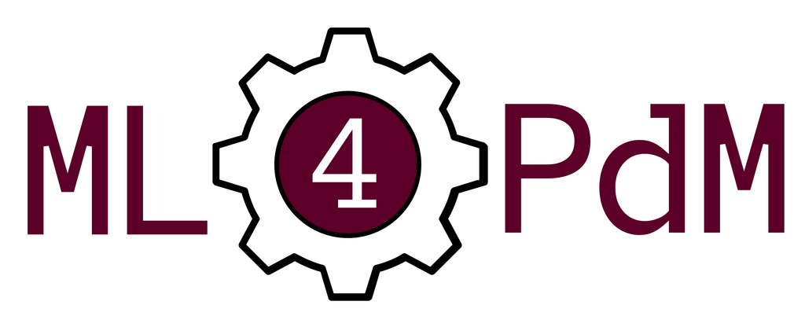

<div align="center">
  
</div>

# Machine Learning for Predictive Maintenance

[](https://www.python.org/)
[](https://scikit-learn.org/stable/index.html)
[](https://git.cs.uni-paderborn.de/machine-learning-for-predictive-maintenance/code/-/commits/master)
[](https://git.cs.uni-paderborn.de/machine-learning-for-predictive-maintenance/code/-/commits/master) 

ML4PdM is a [Python](https://www.python.org/) library for predictive maintenance using machine learning. :rocket:

It allows you to store and load datasets containing time series data, create and execute complex machine learning pipelines, evaluate these pipelines using a large number of metrics and store the entire setup for quick and easy reuse. This library is built as an extension to [scikit-learn](https://scikit-learn.org/stable/index.html) and is 100% compatible with it. :sparkles: This means that you can use all transformers and predictors of sklearn with our library without problems. You can also use all of the numerous metrics that are provided by sklearn to evaluate your approaches that are created using the ML4PdM library.

We created a dedicated Predictive Maintenance File Format (PdMFF) which is good for storing multivariate time series in an effective way. We provided the popular [CMAPSS dataset](https://data.nasa.gov/dataset/C-MAPSS-Aircraft-Engine-Simulator-Data/xaut-bemq) in our PdMFF format to get you started right away. You can find the files in `ml4pdm/data/cmapss/` and find additional information in our [official documentation](https://ml4pdm-docs.czinda.de/).

## :bookmark_tabs: Documentation

We provide you with extensive documentation on a dedicated website found [here](https://ml4pdm-docs.czinda.de/). You can find all information needed to get started with this library. The contents of the documentation are listed below:

* [Installation](https://ml4pdm-docs.czinda.de/01_installation.html)
* [Examples](https://ml4pdm-docs.czinda.de/02_examples.html)
* [Data Format](https://ml4pdm-docs.czinda.de/03_dataformat.html)
* [API](https://ml4pdm-docs.czinda.de/api/modules.html)
* [Glossary](https://ml4pdm-docs.czinda.de/05_glossary.html)
* [Authors](https://ml4pdm-docs.czinda.de/06_authors.html)
* [License](https://ml4pdm-docs.czinda.de/07_license.html)
* [Changelog](https://ml4pdm-docs.czinda.de/08_changelog.html)
* [References](https://ml4pdm-docs.czinda.de/09_references.html)

## :hammer_and_wrench: Makefile Usage

All available make commands and their explanation are listed below. The documentation is built using Sphinx. You can generate it yourself using one of the Sphinx make commands below.

```
Usage:
  make <target>
  help             Display this help.
  conda-setup      Creates the conda environment that is used for developing this library.
  conda-update     Updates the conda environment that is used for developing this library.
  test             Run all tests for the ml4pdm library.
  clean            Cleans Sphinx build files and Python caches.
  gitlab-builder   Builds the Docker image that is being used in the GitLab pipeline.

Sphinx v3.5.3
Please use `make target' where target is one of
  html        to make standalone HTML files
  dirhtml     to make HTML files named index.html in directories
  singlehtml  to make a single large HTML file
  pickle      to make pickle files
  json        to make JSON files
  htmlhelp    to make HTML files and an HTML help project
  qthelp      to make HTML files and a qthelp project
  devhelp     to make HTML files and a Devhelp project
  epub        to make an epub
  latex       to make LaTeX files, you can set PAPER=a4 or PAPER=letter
  latexpdf    to make LaTeX and PDF files (default pdflatex)
  latexpdfja  to make LaTeX files and run them through platex/dvipdfmx
  text        to make text files
  man         to make manual pages
  texinfo     to make Texinfo files
  info        to make Texinfo files and run them through makeinfo
  gettext     to make PO message catalogs
  changes     to make an overview of all changed/added/deprecated items
  xml         to make Docutils-native XML files
  pseudoxml   to make pseudoxml-XML files for display purposes
  linkcheck   to check all external links for integrity
  doctest     to run all doctests embedded in the documentation (if enabled)
  coverage    to run coverage check of the documentation (if enabled)
```

## :earth_africa: Contributing

If you find any issues or have some improvement ideas, please [create an issue](https://git.cs.uni-paderborn.de/machine-learning-for-predictive-maintenance/code/-/issues/new). Also feel free to fork the repo and [create a merge request](https://git.cs.uni-paderborn.de/machine-learning-for-predictive-maintenance/code/-/merge_requests/new) when you have finished your implementation. :page_with_curl:

If your feature is a good addition to the project, it will be merged!

## :scroll: License

<table>
  <tr>
    <td><a rel="license" href="http://creativecommons.org/licenses/by-nc-sa/4.0/"></a></td>
    <td><span xmlns:dct="http://purl.org/dc/terms/" href="http://purl.org/dc/dcmitype/Text" property="dct:title" rel="dct:type">Machine Learning for Predictive Maintenance</span> by <a xmlns:cc="http://creativecommons.org/ns#" href="https://git.cs.uni-paderborn.de/machine-learning-for-predictive-maintenance" property="cc:attributionName" rel="cc:attributionURL">ML4PdM Group</a> is licensed under a <a rel="license" href="http://creativecommons.org/licenses/by-nc-sa/4.0/">Creative Commons Attribution-NonCommercial-ShareAlike 4.0 International License</a>.</td>
  </tr>
</table>
