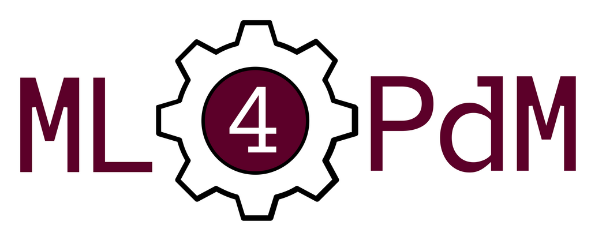

    

Machine Learning for Predictive Maintenance - Documentation
================================================================

ML4PdM is a `Python <https://www.python.org/>`_ library for predictive maintenance using machine learning.

It allows you to store and load datasets containing time series data, create and execute complex machine learning pipelines, evaluate these pipelines using a large number of metrics and store the entire setup for quick and easy reuse. This library is built as an extension to `scikit-learn <https://scikit-learn.org/stable/index.html>`_ and is 100% compatible with it. This means that you can use all transformers and predictors of sklearn with our library without problems. You can also use all of the numerous metrics that are provided by sklearn to evaluate your approaches that are created using the ML4PdM library.

We created a dedicated Predictive Maintenance File Format (PdMFF) which is good for storing multivariate time series in an effective way. We provided the popular `CMAPSS dataset <https://data.nasa.gov/dataset/C-MAPSS-Aircraft-Engine-Simulator-Data/xaut-bemq>`_ in our PdMFF format to get you started right away. You can find the files in ``ml4pdm/data/cmapss/`` and find additional information in our `official documentation <https://ml4pdm-docs.czinda.de/>`_.

.. toctree::
   :maxdepth: 1   

   01_installation
   02_examples
   03_dataformat
   api/modules
   05_glossary
   06_authors
   07_license
   08_changelog
   09_references

Indices and tables
==================

* :ref:`genindex`
* :ref:`modindex`
* :ref:`search`

Acknowledgements
================

We thank the Prognostics Data Repository for making 'Turbofan Engine Degradation Simulation Data Set' and 'PHM08 Challenge Data Set' publicly available.
We would also like to extend our thanks to A. Saxena and K. Goebel, the donators of both the datasets.
Thanks to Vectors Market and the Noun Project for the 'maintenance' icon used in the logo.
